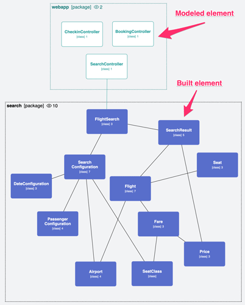
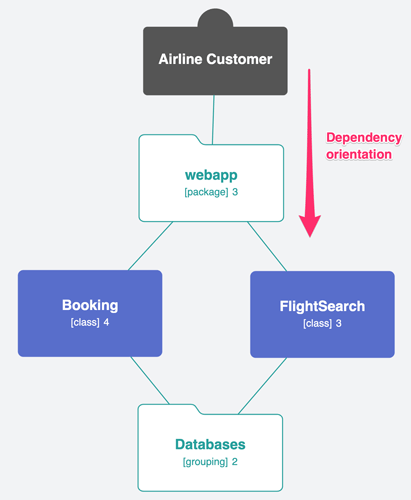
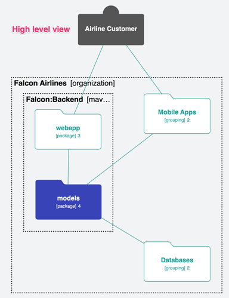
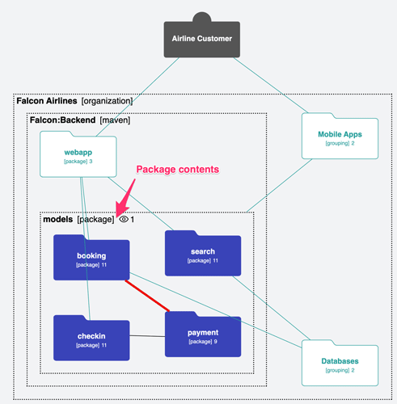
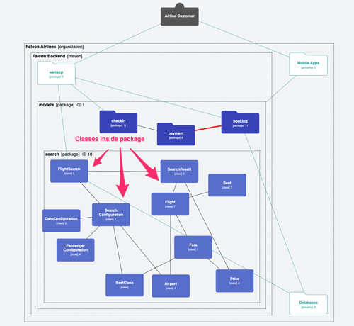
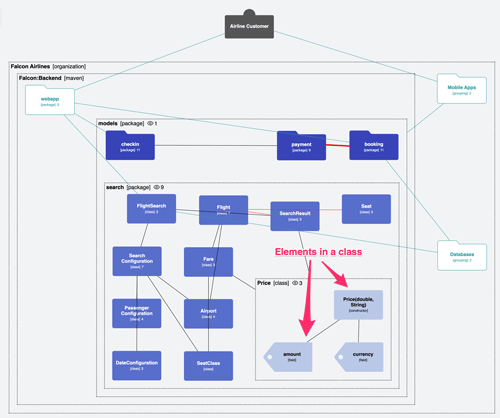
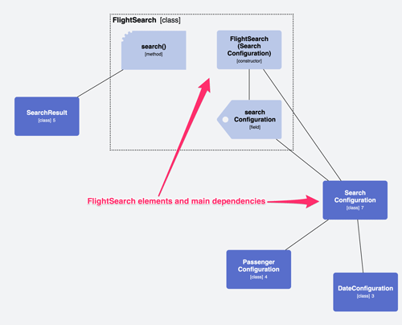

# Getting Started with BELA

Please [schedule an onboarding call](https://calendar.app.google/C5y4SqGjAE8CDKuz5) at your earliest convenience.

In the meantime, you can get a jump start by understanding these basic concepts:

## Built vs modeled elements

BELA enables you to browse **built** and **modeled** elements.

**Built** elements and dependencies are **extracted automatically** from your source code. They’re represented in the diagram by **black** lines and text, with **blue** background.

**Modeled** elements and dependencies are the ones **you create manually in BELA** when doing high-level architecture or planning future changes to your software. They’re represented by **dark green** lines and text, with **white** background.

**Cyan lines** represent **modeled dependencies**.

## Dependency orientation

The lines connecting elements are **dependencies**. By convention, elements depend on elements that are **below** them.

In this example, the `webapp` package depends on the `Booking` and `FlightSearch` classes.

They, in turn, depend on the `Databases` grouping.

## High level view

**Drill into unlimited levels of detail**, from big-picture down to code.

In this example, you can see the **high-level diagram** of a simple Airline system.

It contains only the most important **macro elements** and their **dependencies**.

## Package contents

Double-click on a package to browse its contents.

## Reveal the classes inside

Drill into the search package to reveal its classes.

## Reveal the elements inside a class

Double-click on a class to reveal its elements: *fields*, *methods*, *constructors*, and their *dependencies*.

## Create meaningful diagrams

**Create as many diagrams as you want**, each revealing an important aspect of your software.

Pick and choose **specific elements** in order to have a **better understanding** of them and their dependencies.

## See BELA in action

BELA is specially useful when you’re dealing with **large systems**. You can navigate the elements in a way similar to what you do with Google Maps. Check out the video below for an example of that.

## More Info

 - Visit the [BELA homepage](https://bela.live).
 - Watch [short videos](https://www.youtube.com/@JuxBELA/videos) on advanced AI features.
 - Get a solid grasp of the fundamental [BELA Concepts](Concepts.md).
 - Optional: [Analyze a sofware project](CodeSynchronization.md) and explore the generated architecture file that will be sent to BELA.

"Stop drowning in complexity. Start navigating."
