# Getting Started

The first thing you see when you log in to BELA is a box representing your organization. If your team has already be using BELA, you might see more elements there too.

## Rename organization

Click the box at the center of the screen, which represents your organization.

Click on the name of the organization in the detail pane, on the right side, to rename it.

Add a description in the field below.

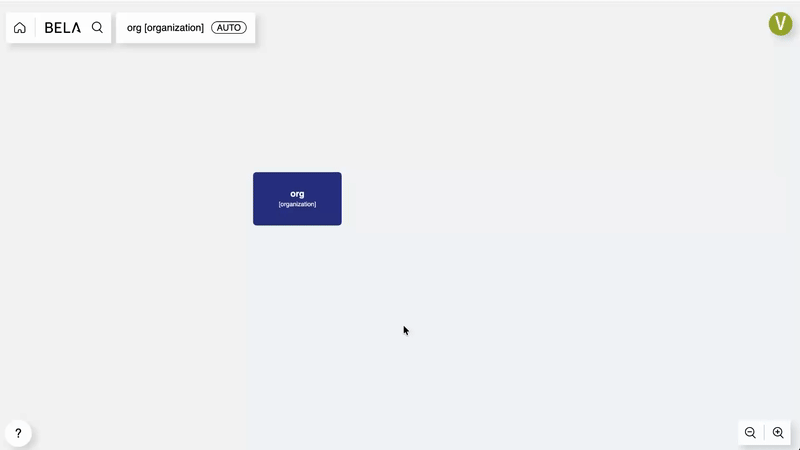

## Create your first diagram

Click on the BELA logo in the upper-left corner and select the “New” option from the menu.

Click on the name of the diagram to rename it.

Check out: [<u>How can I understand a diagram in BELA</u>](https://github.com/juxhouse/bela-resources/blob/main/GettingStarted.md#how-can-i-understand-a-diagram-in-bela)?

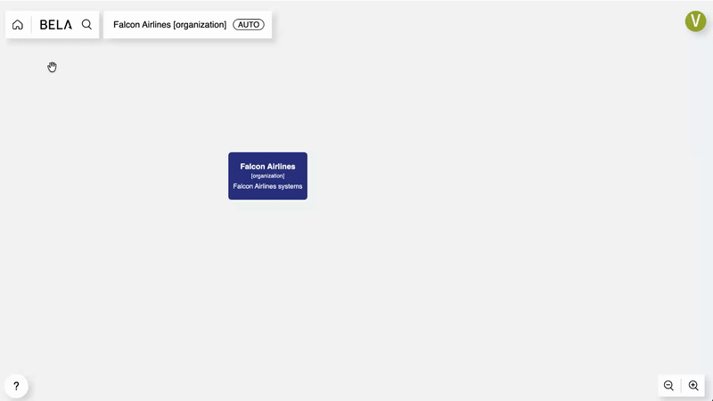

## Create your first element

Right click on the diagram and choose the “Create element” option from the menu.

Enter the name, type, and description of element on the upper-right details panel.

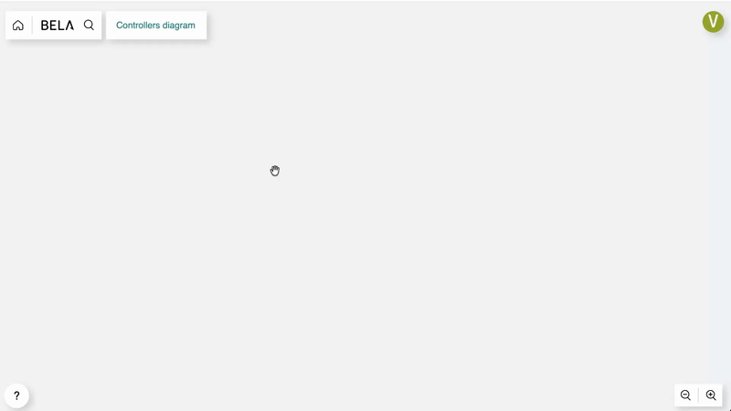

## Create your first dependencies

Create another element. Then drag the arrow at the bottom of the element to the other element it should depend on.

Right click on the dependency to choose its type.

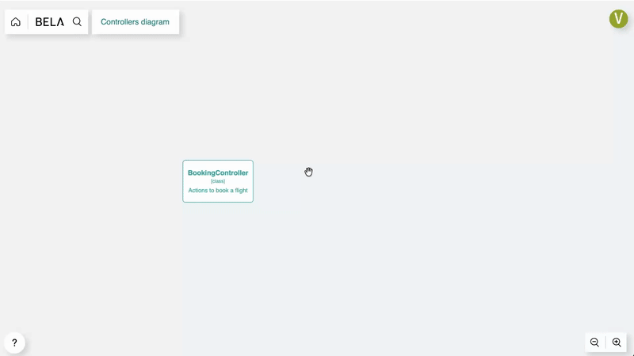

## Dependencies in the detail pane

Click on a dependency to get more information about it on the detail pane.

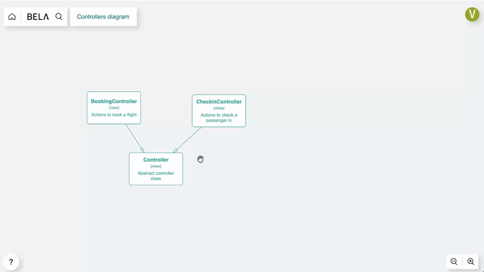

## Understand dependencies meaning

Click the question-mark icon (?) in the bottom-left corner to open the legend.

It explains the different meanings of the dependencies.

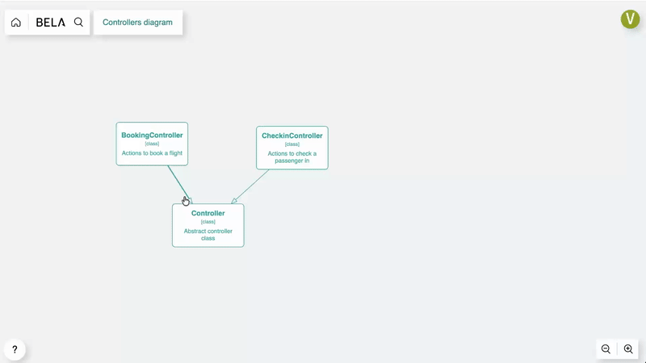

## Create your first containment

Right click on the diagram and choose the “Create element” option from the menu.

Enter the name, type, and description of the element on the upper-right details pane.

This time, choose “package” as the type.

Move the previous elements into the package.

See [<u>BELA Conceps</u>](https://github.com/juxhouse/bela-resources/blob/main/Concepts.md) to learn about ECDs

## Switch to the organization diagram

Click on the magnifying glass icon near the BELA logo in the upper-left corner to search for elements and diagrams.

Select the “context diagram”.

Notice that you’ll find in it the elements you’ve created in your first diagram.

## Create your first 3rd party element

Right click on the diagram and choose the “Create element” option from the menu.

Enter the name, type, and description of element on the upper-right details panel.

Choose the type “person” and change it to 3rd party.

It will then the placed outside the organization in the context diagram.

## Open an element in a new diagram

Right click on an element and select the “Open in New Diagram” option.

BELA creates a new diagram containing only that element.

From there you can insert new elements in the diagram by right clicking the diagram and choosing the “Insert element” option.

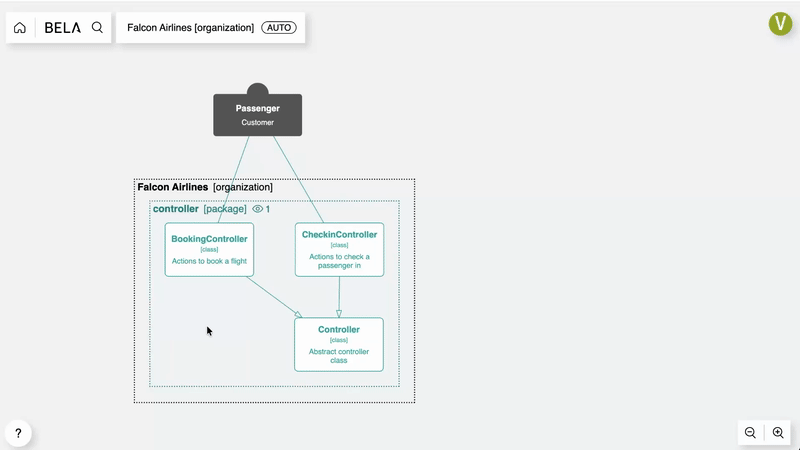

## Find out which diagrams an element is in

Click on an element to open the detail pane on the right.

Then click on the “Modeled diagrams featuring element” on the detail pane.

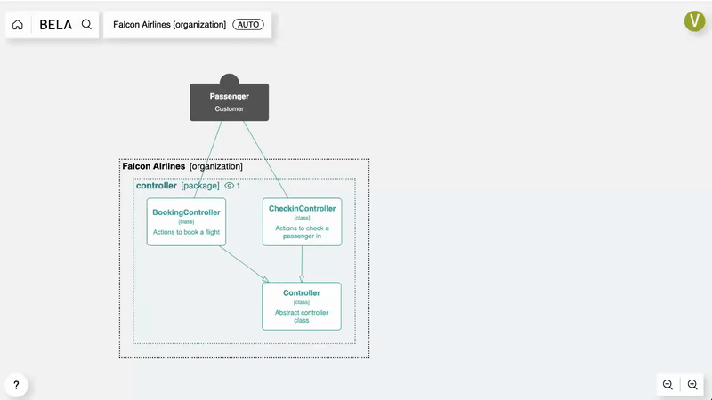

## Synchronize your code with BELA

See [<u>Code Synchronization</u>](https://github.com/juxhouse/bela-resources/blob/main/CodeSynchronization.md).

Generate the ECD file by running the BELA Updater Docker App.

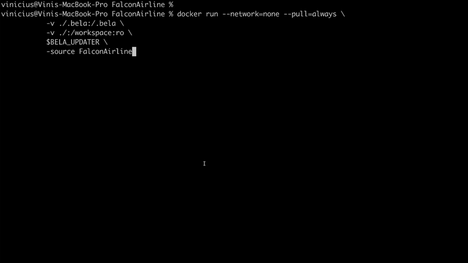

## Upload the ECD file to BELA.

Click on the BELA logo in the upper-left corner and select the “Source” option from the menu.

Click on the “Upload” button.

Select the ECD file that you generated in the previous step.

## See the source of a built element

After the code synchronization, you can see the source of a built element in the detail pane.

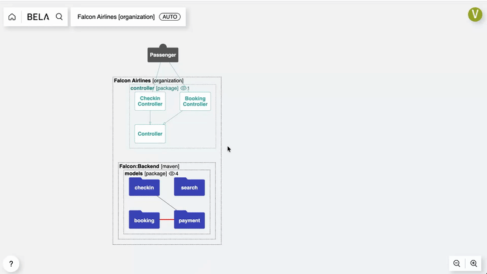

## View the element path

You can also see the built element’s path on the upper-right, in the detail pane.

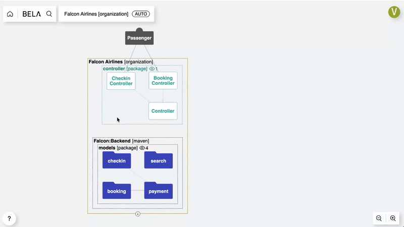

## Use AI to organize elements in a diagram

When there are too many elements in a diagram, you can ask AI to organize them.

Right-click on the containment and choose the “Organize” option.

AI creates meaningful groupings. They help you to organize diagrams and plan future refactorings.

## Add details to a built element

You can’t change the name or the type of a built element, but you can add a description to make it easier for other people to understand them.

Click on an element and write a description for it on the details pane.

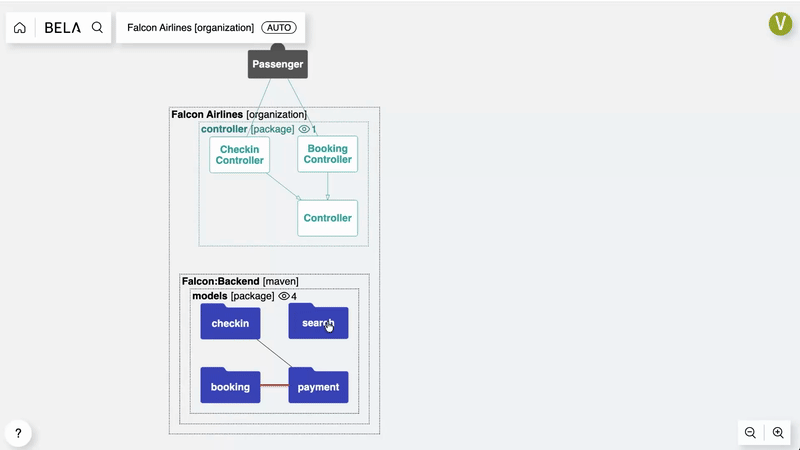

## Use AI to create meaningful descriptions

Click on an element and then click on the IA icon in the description field in the details pane.

AI tries to understand the whole picture and come up with a useful description for the element.

## Use AI to generate new elements

Right click on a containment and choose the “Generate contents” option. Type the kind of element you want to create.

If you click on a package, for instance, you can ask AI to generate classes.

If you click on a class, you can ask AI to generate methods.

AI tries to understand the whole picture and come up with elements that make sense.

## Search for an element

When you want to find an element, click on the magnifying glass icon near the BELA logo in the upper-left corner and type its name.

BELA creates a diagram automatically and places the element there.

## Insert an element into a diagram

To insert an element into an existing diagram, right click on the diagram and choose the “Insert element” option.

Type the name of the element.

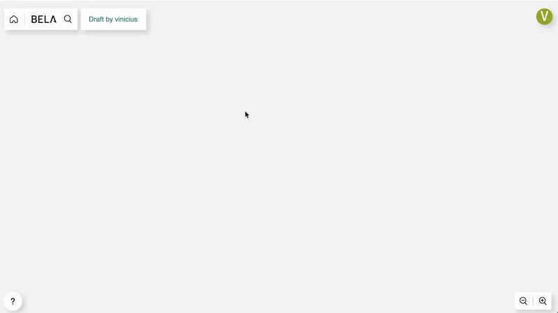

## Remove an element from the diagram

To remove an element from the diagram, right click on the element and choose the “Remove from diagram” option.

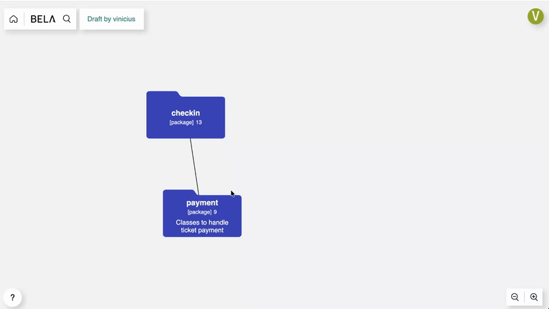

## Delete a modeled element

To delete a modeled element, right click on the element and choose the “Delete element” option.

Type the name of the element to confirm.

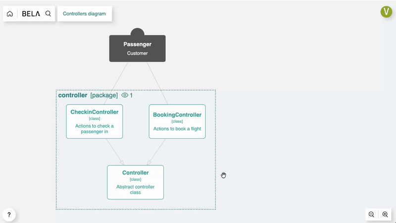

## Delete built elements

It is not possible to delete a single built element. It is only possible to delete modeled elements.

But it is possible to delete all the built elements of a given source.

Click on the BELA logo in the upper-left corner and select the “Source” option from the menu.

Click on “All sources”.

Click on the 3 dots icon at the end of the line corresponding to the source you want to delete.

Choose the “Delete source…” option.

Type the name of the source to confirm.

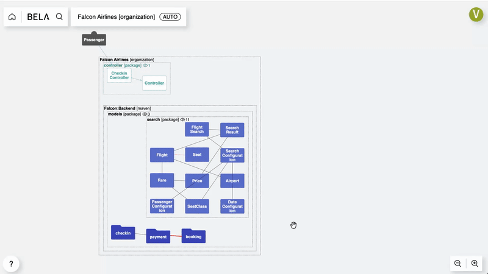
