[**What can I do with BELA?**](#what-can-i-do-with-bela)

[**How can I understand a diagram in BELA?**](#how-can-i-understand-a-diagram-in-bela)

> [What boxes represent?](#what-boxes-represent)
>
> [Elements](#elements)
>
> [Modeled Elements](#modeled-elements)
>
> [Built Elements](#built-elements)
>
> [Containments](#containments)
>
> [What do the lines represent?](#what-do-the-lines-represent)
>
> [How can I view the legend?](#how-can-i-view-the-legend)
>
> [How does BELA's automatic layout work?](#how-does-belas-automatic-layout-work)
>
> [How can I browse different levels of structure?](#how-can-i-browse-different-levels-of-structure)

[**How can I see my projects in BELA?**](#how-can-i-see-my-projects-in-bela)

[**How can I model elements and dependencies?**](#how-can-i-model-elements-and-dependencies)

> [How can I create a modeled element?](#how-can-i-create-a-modeled-element)
>
> [How can I generate new elements using AI?](#how-can-i-generate-new-elements-using-ai)
>
> [How can I add a description to an element?](#how-can-i-add-a-description-to-an-element)
>
> [How can I generate a description using AI?](#how-can-i-generate-a-description-using-ai)
>
> [How can I delete a modeled element?](#how-can-i-delete-a-modeled-element)
>
> [How can I create a modeled dependency?](#how-can-i-create-a-modeled-dependency)
>
> [How can I change the meaning of a modeled dependency?](#how-can-i-change-the-meaning-of-a-modeled-dependency)
>
> [How can I delete a modeled dependency?](#how-can-i-delete-a-modeled-dependency)

[**How can I work with a diagram?**](#how-can-i-work-with-a-diagram)

> [How can I insert elements into a diagram?](#how-can-i-insert-elements-into-a-diagram)
>
> [How can I remove an element from a diagram?](#how-can-i-remove-an-element-from-a-diagram)
>
> [How can I open an element in a new diagram?](#how-can-i-open-an-element-in-a-new-diagram)
>
> [How can I browse an element?](#how-can-i-browse-an-element)
>
> [How can I zoom in and out?](#how-can-i-zoom-in-and-out)
>
> [How can I move the entire diagram around the screen?](#how-can-i-move-the-entire-diagram-around-the-screen)
>
> [How can I create a sticky note?](#how-can-i-create-a-sticky-note)
>
> [How can I ungroup modeled elements?](#how-can-i-ungroup-modeled-elements)

[**How to manage diagrams?**](#how-to-manage-diagrams)

> [How can I create a new diagram?](#how-can-i-create-a-new-diagram)
>
> [How can I find previously created diagrams?](#how-can-i-find-previously-created-diagrams)
>
> [How can I rename a diagram?](#how-can-i-rename-a-diagram)
>
> [How can I duplicate a diagram?](#how-can-i-duplicate-a-diagram)
>
> [How can I delete a diagram?](#how-can-i-delete-a-diagram)

# What can I do with BELA?

BELA enables you to visualize your actual software architecture and to create models manually too.

- **Built elements** (blue boxes) are extracted automatically from your source code.
- **Built dependencies** (black lines) are extracted automatically from your source code.
- **Modeled elements** (white boxes with cyan text) are the elements you create manually in BELA.
- **Modeled dependencies** (cyan lines) are the dependencies you create manually in BELA.

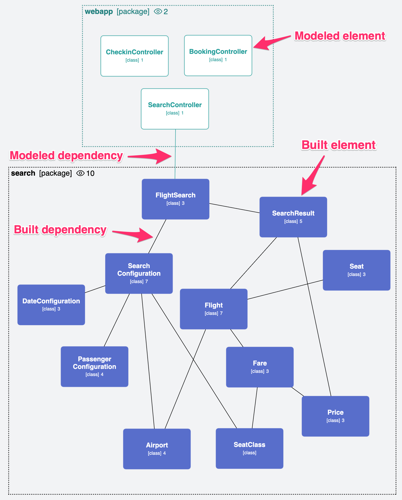

# How can I understand a diagram in BELA?

## What boxes represent?

A box represents an element or container.

### Elements

Elements are the nouns that compose software structure: projects, classes, methods, etc.

Each Element has a type, shown in \[brackets\].

Element type examples: domain, system, project, service, component, namespace, package, interface, class, function, method, field, database, bucket, table, data-set, endpoint, topic, queue, etc.

You can create your own element types.

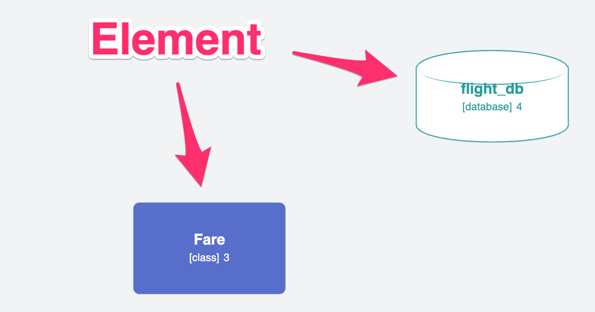

### Modeled Elements

Modeled elements are manually created (modeled) in BELA and do not exist in your production artifacts. They are useful for modeling third-party systems and exploring future plans for your software.

You can change their name, type, description, and other attributes at will.

Element names can be user-friendly and don't need to be unique. They can include UTF-8 characters, including emojis and spaces.

### Built Elements

Built elements refer to elements that actually exist in your production artifacts and are synced to BELA. They cannot be individually deleted or altered (only augmented) by users.

### Containments

An element can contain other elements, forming an arbitrarily deep containment hierarchy.

For example, a project can contain a package, which can contain a class, which can contain a method.

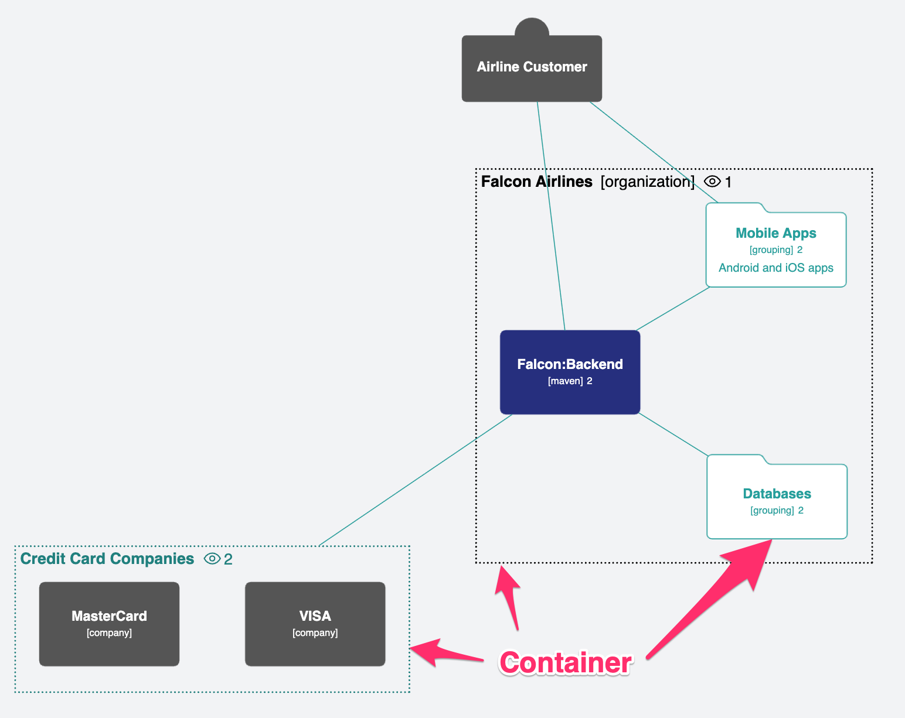

## What do the lines represent?

The lines connecting elements represent **dependencies**. Any element can depend on any other element.

By convention, elements depend on elements that are **below** them.

In this example, the `webapp` package depends on the `Booking` and `FlightSearch` classes.

They, in turn, depend on the `Databases` grouping.

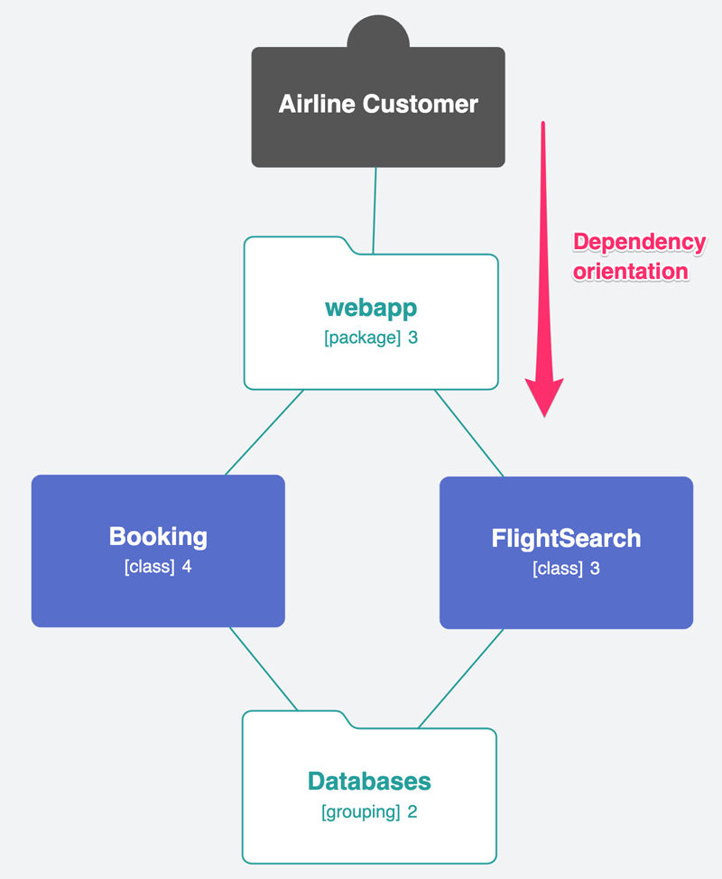

## How can I view the legend?

You can use the Diagram Legend tool (question-mark icon in the bottom-left corner) to see the colors and styles used to display different ECDs.

Click the question-mark icon (?) in the bottom-left corner to open the legend.

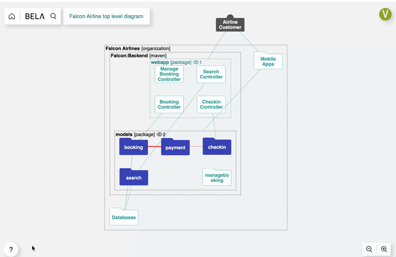

## How does BELA's automatic layout work?

You don’t need to waste time organizing objects when you show them on the diagram.

BELA automatically adjusts the layout to fit elements on the screen and ensure they are positioned correctly, respecting the dependency convention. When there is a dependency from element A to element B, BELA will automatically try to position A further up and B further down.

## How can I browse different levels of structure?

Double-click a container to reveal the elements inside it. If there are other containers inside, you can double-click them to reveal their contents.

To collapse a container that has been previously opened, double-click it again.

# How can I see my projects in BELA?

See [Code Synchronization](CodeSynchronization.md)

# How can I model elements and dependencies?

## How can I create a modeled element?

Right-click on a point in the diagram where you would like to create a new element. If you click inside a container, the new element will be created inside it.

Choose the “Create element” option from the menu that appears.

Enter the name, type, and description of the element on the upper-right panel.

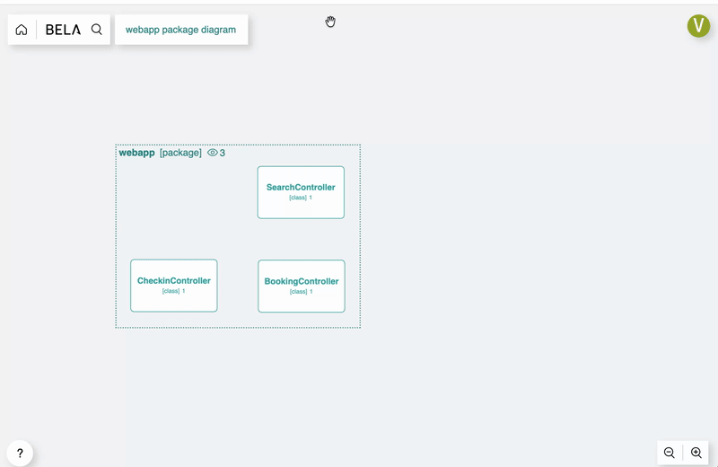

## How can I generate new elements using AI?

You can use AI to generate new elements automatically.

Right-click on a point in the diagram where you would like to create the new elements.

Choose the “Generate contents” option from the menu that appears.

Specify the type of elements you would like the AI to generate. In the example below, the user asks the AI to generate classes for a given package.

The AI uses the name of the package and the general context to generate classes that fit the purpose of the package.

## How can I add a description to an element?

Click on the element and edit the description in the upper-right panel.

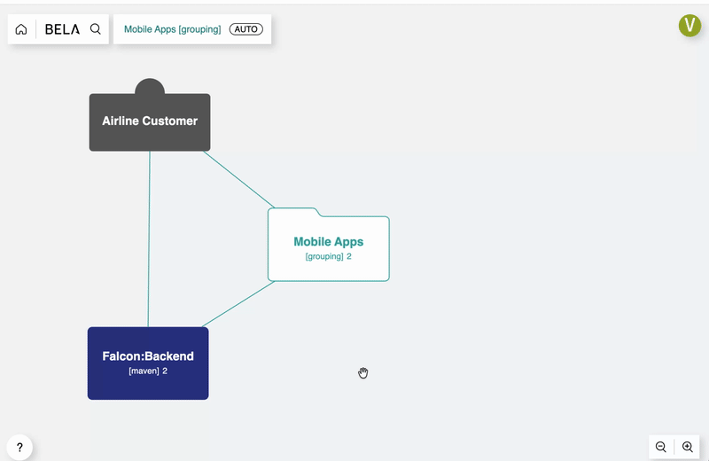

## How can I generate a description using AI?

Click on the element, then click the AI icon at the end of the description field in the upper-right panel.

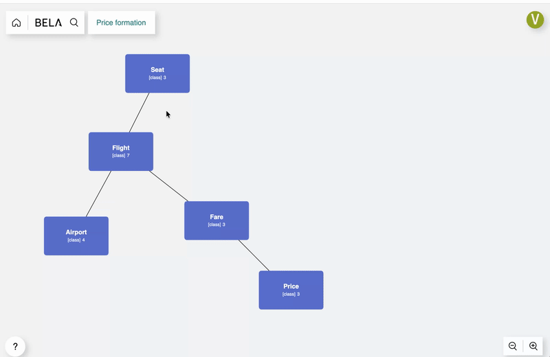

## How can I delete a modeled element?

Right-click on the element and choose the “Delete element…” option from the menu.

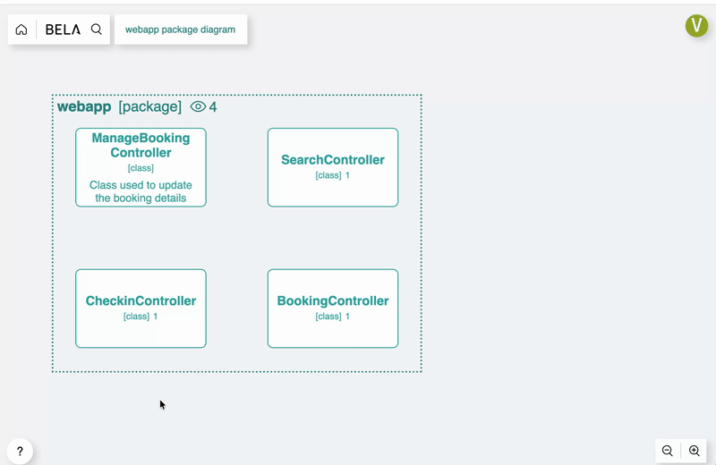

## How can I create a modeled dependency?

Click on the element to select it. Then drag the arrow at the bottom of the element to the other element it should depend on.

In the example below, we want **PassengerRecord** to depend on **BoardingPass**. So we drag the arrow from **PassengerRecord** to **BoardingPass**.

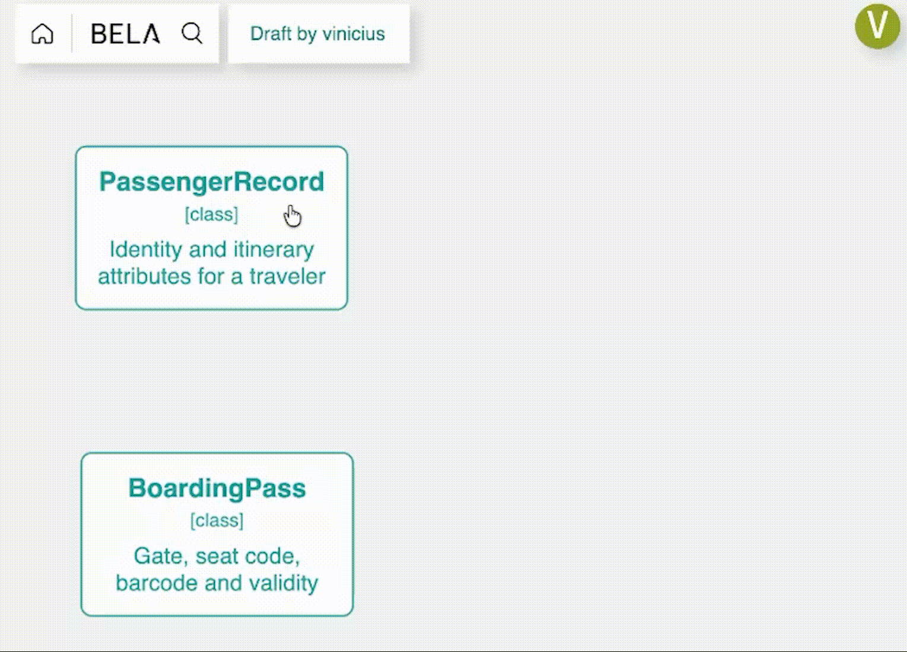

## How can I change the meaning of a modeled dependency?

You can add more details about the meaning of a dependency.

Right-click on the dependency and choose the appropriate meaning from the menu.

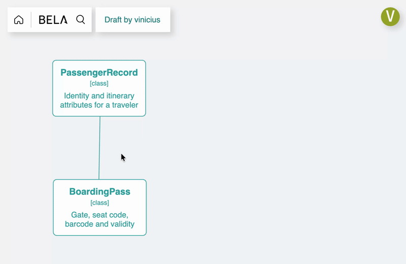

## How can I delete a modeled dependency?

Right-click on the dependency and choose the “Delete” option from the menu.

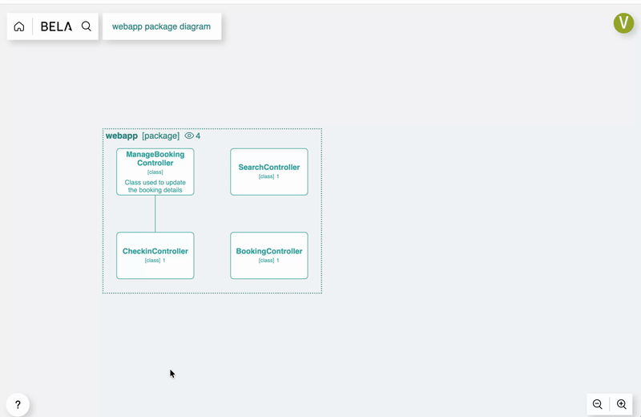

# How can I work with a diagram?

## How can I insert elements into a diagram?

Right-click on the diagram and select the “Insert element…” option from the menu.

Type the name of the element you want to insert into the diagram.

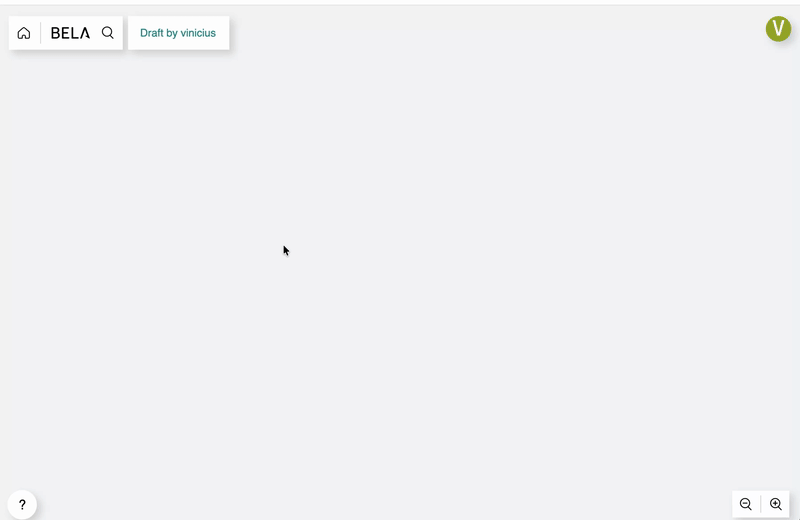

## How can I remove an element from a diagram?

Right-click on the element and choose the “Remove from Diagram” option.

The element will only be removed from the diagram. It will not be deleted, which means it can be reinserted into the diagram or appear in other diagrams.

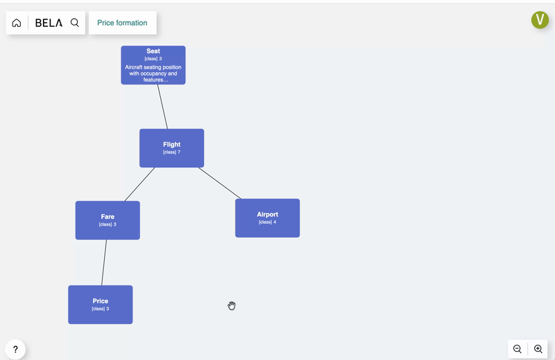

## How can I open an element in a new diagram?

You can easily create a new diagram that contains only the selected element.

Right-click on the element and select the “Open in New Diagram” option.

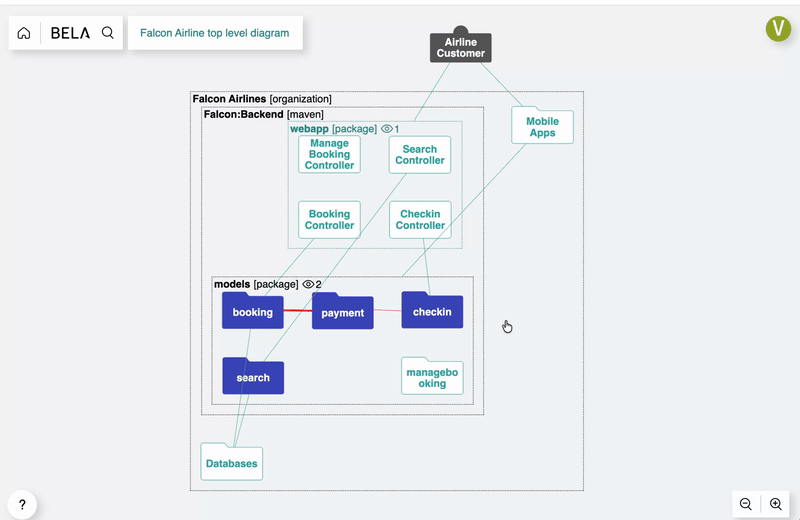

## How can I browse an element?

You can create a diagram that contains only the selected element, its immediate dependencies, and the elements that immediately depend on it.

Right-click on the element and select the “Browse” option.

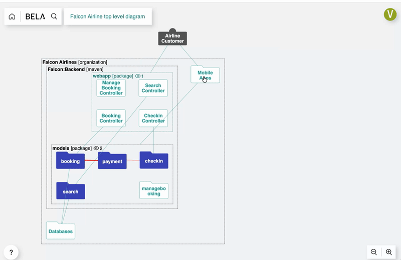

## How can I zoom in and out?

To zoom in and out, use the magnifying glass buttons in the bottom-right corner, or use the mouse wheel.

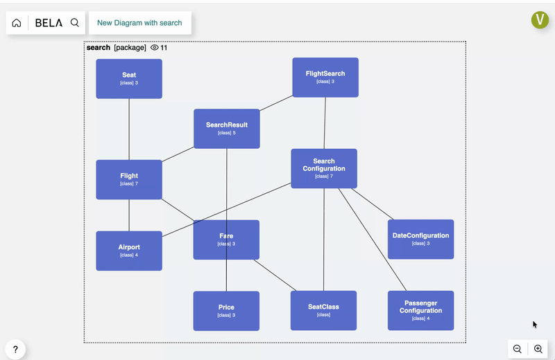

## How can I move the entire diagram around the screen?

Press and hold the right mouse button, then move the mouse to drag the diagram around the screen.

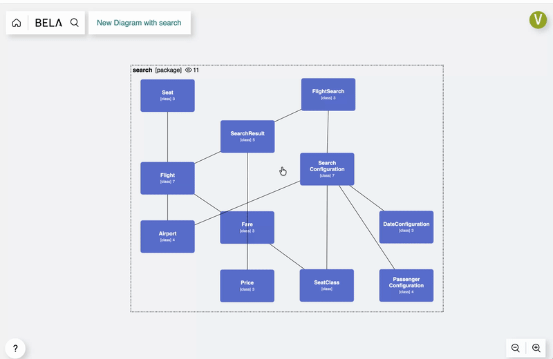

## How can I create a sticky note?

Right-click on the element you want to attach the sticky note to. Then select the “Create Sticky Note” option from the menu.

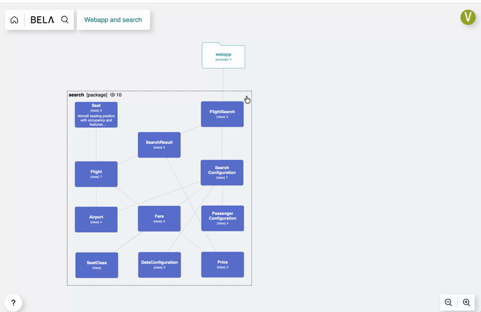

## How can I ungroup modeled elements?

Right-click on a container and select the “Ungroup…” option from the menu.

# How to manage diagrams?

## How can I create a new diagram?

Click on the BELA logo in the upper-left corner and select the “New” option from the menu.

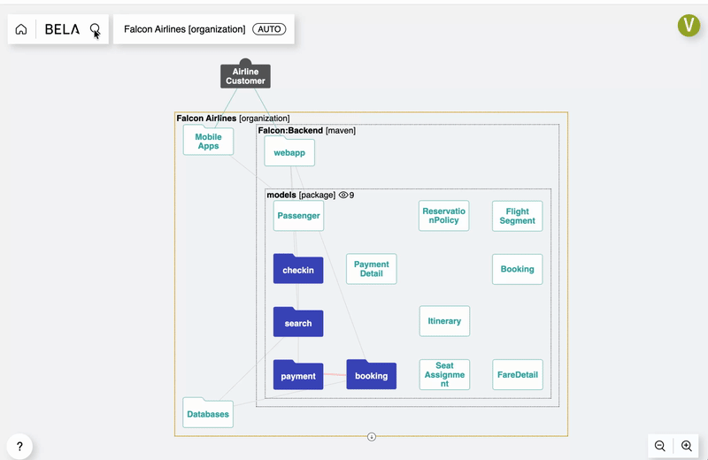

## How can I find previously created diagrams?

Click on the magnifying glass icon near the BELA logo in the upper-left corner. Enter the name of the diagram you are looking for.

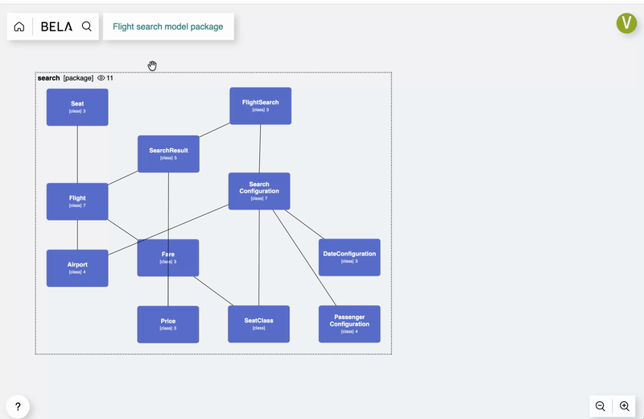

## How can I rename a diagram?

Click on the name of the diagram in the upper-left corner to rename it.

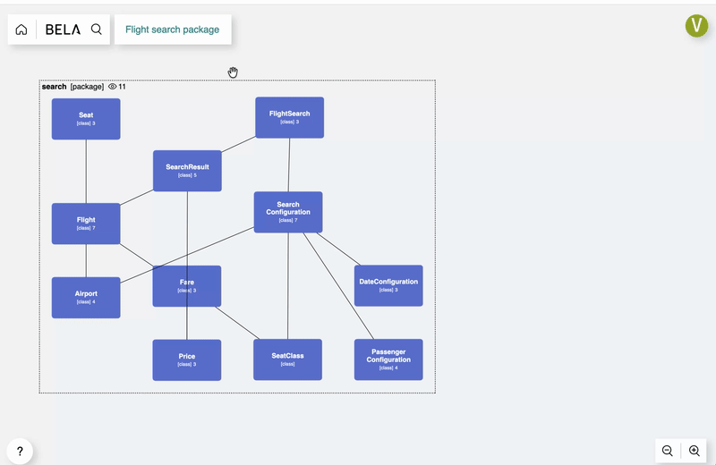

## How can I duplicate a diagram?

Click on the BELA logo in the upper-left corner and select the “Duplicate” option from the menu.

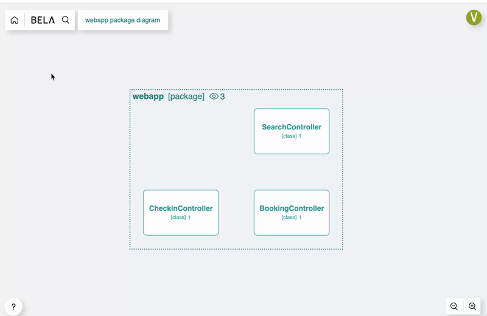

## How can I delete a diagram?

Click on the BELA logo in the upper-left corner and select the “Delete…” option from the menu. Confirm by entering the name of the diagram.

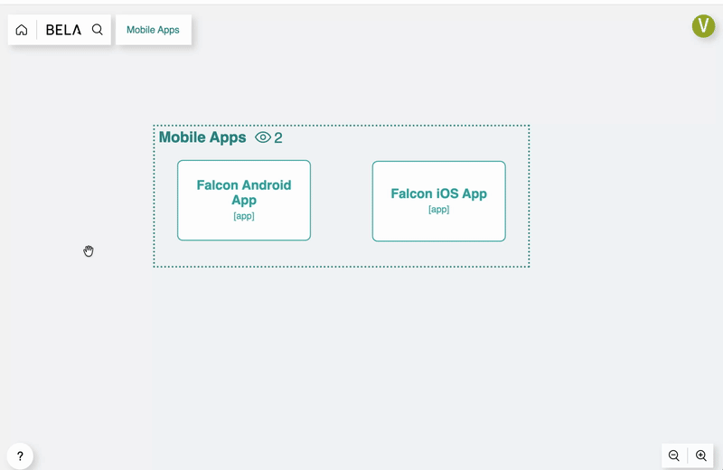
