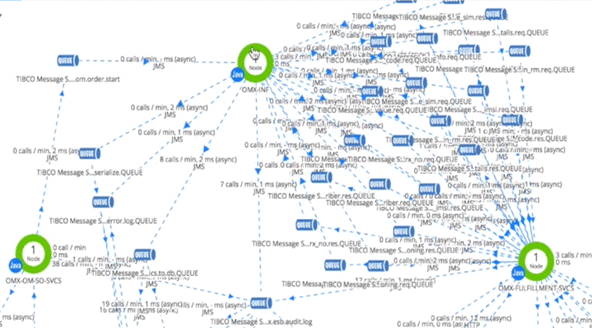

# Leveraging Telemetry/APM Data with BELA

BELA ingests data from Telemetry/APM platforms like Datadog, Dynatrace, Elastic APM and AppDynamics, and combines it with source-of-truth systems such as CMDBs, code repositories and service catalogs.

The result is a unified architectural model — enabling insights and navigation that APM tools alone cannot provide.

## From Small Flows to Scalable Architecture Maps

APM tools are useful for debugging small flows, with a few elements:

<Diagram Here>

As APM views grow, they become cluttured and unmanageable:

Some tools fall back to circular layouts — visually interesting, architecturally meaningless:

<Diagram Here>

BELA scales to millions of elements, preserving structure, hierarchy, and navigability far beyond the limits of APM views.

## From Call Traces to Structure

APM tools see only runtime behavior — stack traces and network calls — and cannot distinguish:

 - a direct dependency call from an injected one
 - a framework invocation from business logic coupling
 - a normal HTTP request from a webhook callback

So they produce diagrams that reflect only low-level execution activity.

BELA separates runtime activity from true architectural structure.

It ingests telemetry, but also analyzes source code and compiled artifacts — mapping only actual dependencies and structural relationships, not incidental runtime flows. This yields accurate, meaningful, navigable architectural views.

And when you need runtime detail, BELA also lets you open the element directly in your APM tool with a single click.

## From a Global Soup to Governance

APM tools model all elements in a single flat space, sometimes grouped coarsely by type or physical layer.

BELA organizes everything — telemetry, services, repos, libraries, endpoints, data sets — into your actual architecture model, whether that's:

 - Domains and Subdomains
 - Products and Capabilities
 - Business Units and Business Areas
 - Services and Modules
 - Etc

You define your architecture and BELA maps your telemetry into it.
