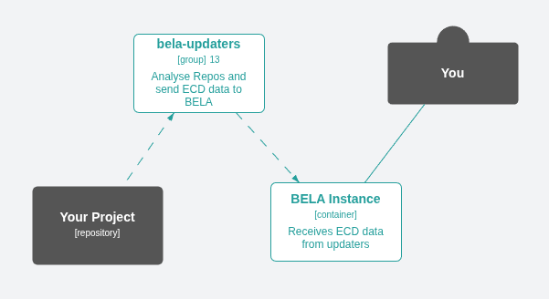

# ECD File Format (.ecd)

This is the format of the [architecture data](/Concepts.md#ecds) file produced by the [BELA updater apps](/CodeSynchronization.md#2-run-the-bela-updater-docker-app) and sent to the [BELA API](/API.md).



This ECD format is designed for conciseness and readability. It is also extensible, by allowing custom JSON metadata.

There is a more formal [syntax specification](#appendix---syntax) at the end.

## License

This format is Copyright Jux Tecnologia ltda. You may use it freely. To avoid incompatibility hell, if you use a similar format that is not compatible with the latest version of this file format, you are not allowed to call it "ECD" or similar.

## Example
```
v1
source my-source-name
/maven/my-company:my-project "My Project" (java)
  > /maven/org.apache.commons:commons-collections4/version/3.0.1
  business [package]
    billing [package]
      Invoice [class]
        getCustomer() [method]
          > business/customers/Customer
          > /*/getAddress()
    customers [package]
      Customer [class]
        setName(String) [method]

/grouping/libs/maven [grouping]
  /maven/org.apache.commons:commons-collections4
```

## Encoding

UTF-8

## Versioning

The format is currently at version 1, so the first line of the file is always `v1`.

Future versions will use the [BoringVer](https://medium.com/@klauswuestefeld/boringver-ad84d272a380) versioning scheme.

## Line-Based

ECD is a line-based format, so newline characters (CR and LF) in your strings must be escaped. More on that below.

> [!TIP]
> ECD files are designed to be read with line-wrap off.

#### Comments

Blank lines and lines starting with hashtag (#) are ignored. In-line comments are **NOT** supported.

## Source

The second line in the file is `source` followed by the name of the [source](/Concepts.md#sources). It is a [quotable string](#quotable-string) with max length of 100.

## ECD Lines

Each line that follows is one of:
 - [Element Line](#element-line)
 - [Dependency Line](#dependency-line)
 - [Alert Line](#alert-line)

A Containment is declared simply by nesting an Element Line below another.

#### Nesting

Lines can be nested below an Element Line. Each nesting level uses exactly two spaces for indentation.

#### Element Line

Element lines are composed of:

 - [Absolute Path](#absolute-path) or [Child Path Segment](#child-path-segment) or [Element Query](#element-query)
 - [Element Type](#element-type) (optional)
 - [Element Name](#element-name) (optional)
 - [Tags](#tags) (optional)
 - [Custom Metadata](#custom-metadata) (optional)

#### Base Element

An [Element Line](#element-line) that is not nested is called a `Base Element`. It is used as the base path for subsequent [Relative Path References](#relative-path-reference).

#### Dependency Line

Dependency lines start with `> ` followed by:

 - [Absolute Path](#absolute-path) or [Relative Path](#relative-path) or [Element Query](#element-query)
 - [Dependency Name](#dependency-name) (optional)
 - [Tags](#tags) (optional)
 - [Custom Metadata](#custom-metadata) (optional)

#### Absolute Path
A slash `/` followed by a [path](/Concepts.md#element-path). It is a [quotable string](#quotable-string) with max length of 1024. If this absolute path reference is nested, that creates an EXPLICIT containment: the parent element will contain this referenced element, which must not be implicitly contained by any other.

#### Relative Path
A [quotable string](#quotable-string) that does not start with slash `/`. It will be appended to the path of the previous [Base Element](#base-element) to form an [Absolute Path](#absolute-path).

#### Child Path Segment
A nested child element is declared using only its last path segment. It is a [quotable string](#quotable-string) that does not contain a slash `/`. Most elements in the example ECD above are declared like this. Its path will be composed of its parent's path + `/` + this segment. Child elements are IMPLICITLY contained by their parent and cannot de explicitly contained by any other built element.

#### Element Query
Slash-asterisk-slash `/*/` followed by the last path segment of some element. Example: `/*/getAddress()`.

If the line also includes a [type](#element-type), it will be used as a query filter too.

A warning is generated in case of ambiguity (more than one `getAddress()` elements found, for example).

#### Element Type
An [identifier](#identifier) between square brackets. Examples: `[domain]`, `[subdomain]`, `[service]`, `[package]`, `[class]`, `[endpoint]`, etc.

#### Element Name
A [quotable string](#quotable-string) with max length of 512. Example: `"My Project"`. If ommitted, the last path segment will be used as the element name. It must be quoted if it starts with `(`.

#### Tags

A list of identifiers between parentheses. Example: `(tag1 tag2 tag3)`. Example tags: `async` `python` `critical`, etc.

#### Dependency Name

A [quotable string](#quotable-string) with max length of 128. Example: `"GET customer{id}"`. It must be quoted if it starts with `(`.

#### Custom Metadata

Each line can have custom metadata as a JSON object at the end. It must be formatted as a single line, without newline characters (default in most JSON libs).

The `description` attribute of this JSON object is the element's description. All other attributes are displayed by BELA as metadata in the element details panel.

#### Alert Line

Alert lines start with `! ` followed by:
 - Title - A [quotable string](#quotable-string)
 - Level - `[error]`, `[warning]` or `[info]`.
 - Details - A JSON-escaped string.

Example:
```
        ! "Exception while resolving dependency" [error] "Exception stack as a JSON string"
```

#### Quotable String 
A string of any Unicode chars except double-quotes and newline. It can optionally be surrounded by double-quotes. It must be surrounded if it contains spaces.


#### Identifier
A string that begins with a lowercase letter (a-z), followed by lowercase letters, digits and hyphens (not underscore). Max length 32.


## Appendix - Syntax
This is the ECD syntax specification as an EBNF grammar.

#### EBNF Notation Summary
 - Optional: [ ... ]
 - Repetition: { ... }
 - Alternatives: ...|...

#### ECD Syntax Version 1
Blank lines and lines starting with hashtag (#) are ignored. They can be used for comments. All other lines follow this grammar:

```ebnf
ecd-file          = header ,
                    body ;

header            = 'v1' , newline ,
                    'source' , space , source-name , newline ;
source-name       = quotable-string ;  // Max length of 100.

body              = { ecd-line } ;
ecd-line          = element-line | dependency-line , newline;

dependency-line   = nesting , { nesting } , '>' , space , absolute-path | child-segment | element-query ,            [ dependency-name ] , [ tags ] , newline;
element-line      =           { nesting } ,               absolute-path | relative-path | element-query , [ type ] , [    element-name ] , [ tags ] , [ custom-metadata ] , newline ;
alert-line        =           { nesting } , `!` , space , quotable-string, level , json-string ;
level             = '[error]' | '[warning]' | '[info]' ;

nesting           = space , space ;  // Indentation of 2 spaces for each nesting level. Nesting works like a stack, as one would expect: 1) A line can only make the nesting deeper by one level. 2) When a line returns to a shallower level of nesting, it "pops" the parents that were previously nested at that level or deeper.
space             = ' ' ;

child-segment     = quotable-string ;  // Must not contain slash '/'.
element-query     = quotable-string ;  // Must start with '/*/'.
absolute-path     = quotable-string ;  // Must start with slash '/'. Max length of 1024.
relative-path     = quotable-string ;  // Must not start with slash '/'.

dependency-name   = quotable-string ;  // Max length of 128. It must be quoted if it starts with '(' (open-brackets).
element-name      = quotable-string ;  // Max length of 512. It must be quoted if it starts with '(' (open-brackets).

type              = '[' , identifier , ']' ;  // Max length of 32.
tags              = '(' , identifier , { space , identifier } , ')';
identifier        = ? A string that begins with a lowercase letter (a-z), followed by lowercase letters, digits and hyphens (not underscore). Max length 32. ?

custom-metadata   = ? A JSON object formatted as a single line without newlines. JSON already requires newlines to be escaped in strings. ? ;
json-string       = ? A JSON string ?

quotable-string   = ? A string of any Unicode chars except double-quotes and newline. It can optionally be surrounded by double-quotes and can only contain spaces when surrounded. ? ;
double-quote      = '"' ;  // Unicode U+0022
newline           = '\n' | '\r' ;  // Unicode character CR or LF.
```
